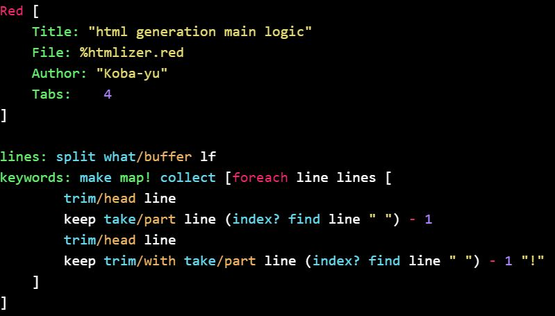

<link href="./css/monokai_extended.css" rel="stylesheet" type="text/css" media="all" />

# RedLight
Simple syntax highlighted html generator for Red.
Highlighted by css, sample css files in the 'css' folder.

## Example


## Usage

The code below introduces `htmlize` function.

```red
do %red-light.red
```

`htmlize` generates string of `pre` and `code` tag data include the argument code.

```red
htmlize {test: 1
print test
; console shows 1}
```

Also source file and url can be used.

```red
htmlize %check-folder-or-file.red
htmlize https://raw.githubusercontent.com/koba-yu/RedStudy/master/Samples/check-folder-or-file.red
```

With `/header` refinement, the html would contain header tag and css reference that was specified by `css` word.

```red
htmlize/header {test: 1
print test
; console shows 1} "monokai_extended" ; css name to be used.
```